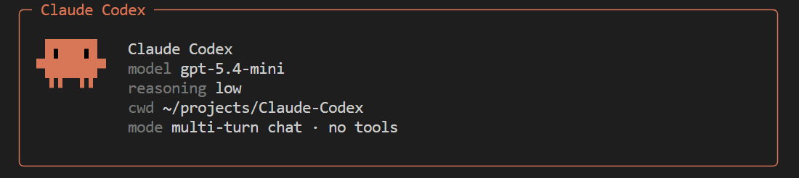

# Claude Codex

An experimental lab series for building an open, local-first agent framework inspired by Claude and Codex.

This repository is designed as a growing sequence of labs that explore the core systems behind capable coding agents: model orchestration, multi-turn reasoning, tool use, memory, repl workflows, and higher-level developer ergonomics. More labs will be added over time, and more of the underlying functionality will be open sourced as the project evolves.

The long-term direction is to assemble these experiments into a cohesive Claude/Codex-style agent: one that can reason across context, operate through tools, and support real developer workflows in a practical local environment.

Starting in `lab3`, Claude-Codex can already do a rough version of real coding work: inspect a repository, edit files, and run a small set of verification commands. It is still intentionally narrow and constrained, but it has crossed the line from "chatting about code" into "helping make code changes." Later labs will increasingly use Claude-Codex itself as part of the workflow to build and test the next pieces of the system.

## Preview



## Labs

- `lab1`: multi-turn chat over a local transcript, backed by the official Codex CLI package, default model `gpt-5.4-mini`, default reasoning effort `low`
- `lab2`: minimal read-only repository agent with `read_file` and `search_code` tools
- `lab3`: a minimal coding agent that can inspect the repo, make bounded edits, and run a small allowlist of verification commands
- `lab4`: the lab3 agent plus durable sessions, persistent transcripts, and a first-pass session memory layer

## Quick start

```bash
bun install
make login
make lab1
make lab2
make lab3
make lab4
```

Debug mode:

```bash
make lab1-debug
```
